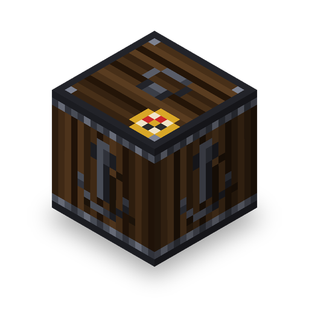

# ⚓ Currents of Trade

**A vanilla-friendly maritime trading, navigation & harbor logistics mod for Minecraft 1.21.1 (NeoForge).**

  <em>Transform Minecraft's vast oceans into thriving commerce routes. Connect coastal villages, sail custom sloops with realistic wave physics, and automate transoceanic cargo fleets.</em>

---

## 🌊 About the Mod

In vanilla Minecraft, vast oceans often serve as mere obstacles to traverse. **Currents of Trade** brings meaning to open waters by creating a living maritime trade network:

- ⚓ **Anchor Point Harbors:** Establish certified docks in coastal villages or player bases with smart open-water validation.
- ⛵ **Custom 3D Sailing Sloop:** High-speed transoceanic travel aboard an authentic sailing ship with billowing sails, turning helms, and natural wave roll.
- 📦 **Autonomous Cargo Shipping:** Dispatch unmanned cargo ships that load chunks along their path, bypass islands, and deliver goods straight to distant harbors.
- 📜 **Trade Ledgers & Fleets:** Seal villager deals into ledgers, launch two-way trade fleets, and buy goods remotely across the world.
- 🧑‍✈️ **Harbormaster Profession & Wandering Sailors:** Discover village docks generated in coastal biomes, trade with port officials, and encounter visiting sea merchants.

---

## 🧭 Key Features

### 1. Anchor Point (Harbor Core)
The foundational block of all maritime operations.
- **Flood-Fill Water Verification:** Requires at least 40 contiguous blocks of open-sky water and 2-block depth (prevents single-bucket exploits).
- **Harbor Renaming:** Automatically names harbors based on biomes (e.g., *Port Ocean, Port Plains*). Easily customize harbor names via the GUI, Nametags, or Anvils.
- **Global Data Sync:** Harbor positions and names are saved persistently world-wide.

### 2. Fast-Travel Voyages (The Sloop)
Forget instant teleportation—embark on genuine high-speed voyages (~36 blocks/sec):
- **Obstacle Avoidance:** 50-block long-range lookahead effortlessly steers around islands and coastlines with safe buffers.
- **Live Navigation HUD:** Action Bar countdown displays real-time harbor distance and voyage progress.
- **Arrival Bell:** Rings upon docking and safely disembarks riders at the pier.

### 3. Unmanned Cargo Logistics (Send Items)
Automate inter-base logistics across limitless ocean distances:
- **18-Slot Cargo Hold:** Fill the hold, insert a destination **Nautical Chart**, and pay the distance fee in **Doubloons**.
- **Dynamic 3x3 Chunk Balloon:** Ships force-load chunks as they sail, ensuring uninterrupted voyages even when players are thousands of blocks away.
- **Physical Dock Delivery:** Moored at destination piers until collected or unloaded via hoppers. Auto-despawns cleanly once empty.
- **Route Obstacle Recovery:** If trapped in an enclosed body of water for 25s, the voyage safely aborts and refunds all items back to the origin dock.

### 4. Remote Trade Orders (Request Trade)
- Bind villager trade offers into a **Trade Ledger** and register them to your harbor.
- Order remote goods in bulk (*Shift + Click batch ordering*), dispatching a **Trade Ship** that sails to the destination port, executes the exchanges, and returns home laden with merchandise.

### 5. World Generation & Coastal Villages
- Naturally spawns harbor piers in coastal and riverside villages via custom Jigsaw injection.
- **CoastalWaterCheckProcessor:** Guarantees docks generate strictly facing open water, never on mountains or landlocked villages.
- **Utility Command:** Run `/cot dock locate` to find the nearest harbor in the world.

---

## 💎 Maritime Commodities & Consumables

| Item | Type | Description |
| :--- | :--- | :--- |
| **Doubloon** | Currency | Minted gold sea coin used for voyage fees and harbor commerce. |
| **Nautical Chart** | Navigation | Stores harbor coordinates and snapshot trade offers upon right-click. |
| **Trade Ledger** | Trade Tool | Right-click villagers to copy trade offers and register them to docks. |
| **Spice Sack** | Consumable | Grants **Speed II** and **Haste I** for a swift burst of energy. |
| **Amber Vial** | Consumable | Potent draught granting **Regeneration II** (causes brief seasickness). |
| **Salt Pouch** | Utility | Preserve perishable foods held in your off-hand. |
| **Exotic Goods** | Commodities | Silk Bales, Tea Bricks, Fine Porcelain, Sandalwood, Luminous Pearls & more. |

---

## 🛠️ Installation & Requirements

1. Make sure you have **[Minecraft 1.21.1](https://minecraft.net/)** installed.
2. Install **[NeoForge 21.1.250+](https://neoforged.net/)**.
3. Download the latest `currents_of_trade-x.x.x.jar` from [Releases](../../releases).
4. Place the `.jar` file into your `.minecraft/mods` folder.

---

## 📜 License

This project is licensed under the **MIT License** - see the [LICENSE](LICENSE) file for details.
